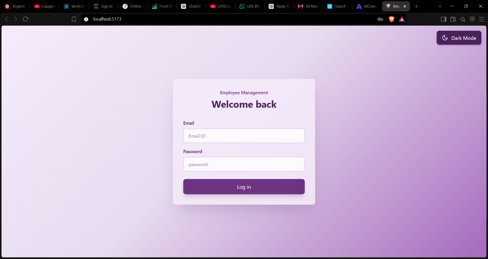
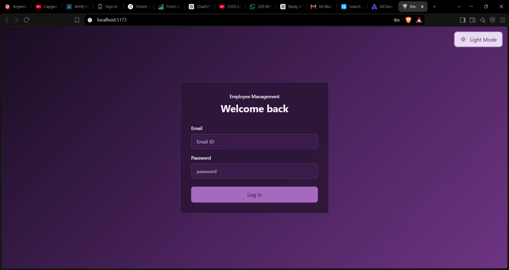
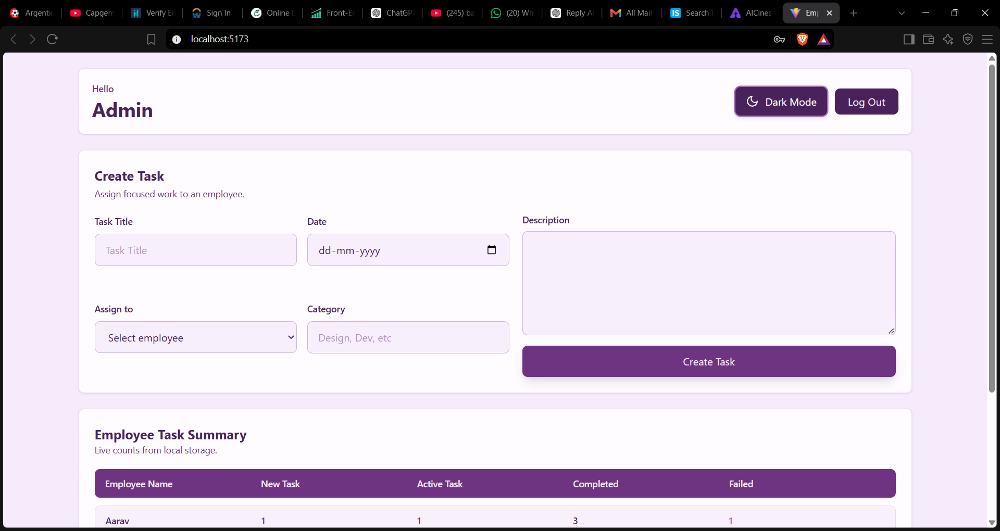
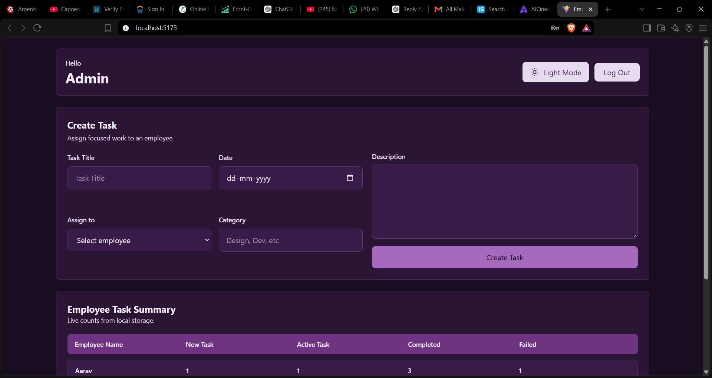
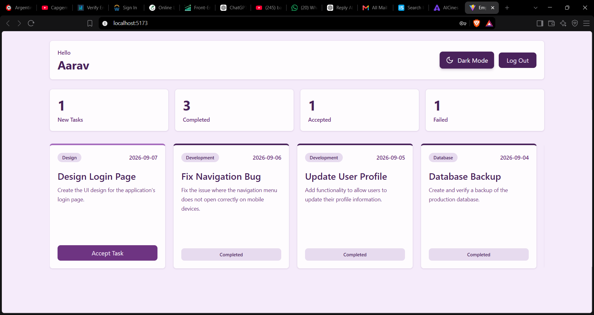
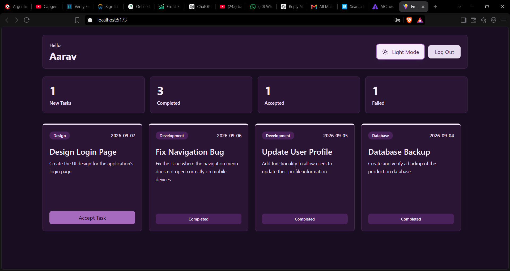

# Employee Management System

A frontend-only employee and task management dashboard built with **React**, **Vite**, and **Tailwind CSS**. The application provides separate admin and employee views, local authentication, task assignment, task statistics, and status-based task displays.

> **Project type:** React frontend / portfolio project  
> **Data layer:** Browser `localStorage`  
> **Backend:** None

## Screenshots

### Login




### Admin Dashboard




### Employee Dashboard




## Features

### Authentication
- Separate admin and employee login flows.
- Email/password login form.
- Logged-in user role is stored in `localStorage`.
- Session state is restored from `localStorage` when the application loads.
- Logout functionality.

### Admin Dashboard
- Create and assign tasks to employees.
- Set task title, description, date, assignee, and category.
- View employees and their task statistics in a table.
- Track:
  - New tasks
  - Active tasks
  - Completed tasks
  - Failed tasks

### Employee Dashboard
- Employee-specific task statistics.
- Separate task cards for:
  - New tasks
  - Active/accepted tasks
  - Completed tasks
  - Failed tasks
- Horizontal scrolling for the task-card section.
- Task cards display category, date, title, description, and available status actions.

### State & Storage
- React Context API is used to share employee data across the application.
- Employee/admin seed data is initialized through `localStorage`.
- Task data is represented with boolean status fields such as `newTask`, `active`, `completed`, and `failed`.

## Tech Stack

- **React** — UI development and component-based architecture
- **Vite** — development server and build tooling
- **JavaScript (JSX)** — application logic
- **Tailwind CSS** — styling and responsive utility classes
- **React Context API** — shared application state
- **Browser localStorage** — client-side persistence

## Application Structure

```text
src/
├── components/
│   ├── Auth/
│   │   └── Login.jsx
│   │
│   ├── Dashboard/
│   │   ├── AdminDashboard.jsx
│   │   └── EmployeeDashboard.jsx
│   │
│   ├── Other/
│   │   ├── AcceptTask.jsx
│   │   ├── AllTask.jsx
│   │   ├── CompleteTask.jsx
│   │   ├── CreateTask.jsx
│   │   ├── FailedTask.jsx
│   │   ├── Header.jsx
│   │   ├── NewTask.jsx
│   │   └── TaskListNumber.jsx
│   │
│   └── TaskList/
│       └── TaskList.jsx
│
├── context/
│   └── AuthProvider.jsx
│
├── utils/
│   └── localStorage.jsx
│
├── App.jsx
├── index.css
└── main.jsx
```

## How It Works

The application starts by wrapping the React app in an `AuthProvider`, which exposes employee data through `AuthContext`.

The main `App` component determines whether the current user is an admin or employee and renders the corresponding dashboard.

```text
                    ┌──────────────┐
                    │ Login Screen │
                    └──────┬───────┘
                           │
              ┌────────────┴────────────┐
              │                         │
          Admin Login              Employee Login
              │                         │
              ▼                         ▼
    ┌──────────────────┐      ┌────────────────────┐
    │ Admin Dashboard  │      │ Employee Dashboard │
    └────────┬─────────┘      └──────────┬─────────┘
             │                           │
      Create / Assign               View Task Stats
          Tasks                    & Task Cards
             │                           │
             └───────────┬───────────────┘
                         ▼
                   localStorage
```

## Getting Started

### 1. Clone the repository

```bash
git clone https://github.com/your-username/employee-management-system.git
cd employee-management-system
```

### 2. Install dependencies

```bash
npm install
```

### 3. Start the development server

```bash
npm run dev
```

Open the local URL shown by Vite in your browser.

### 4. Build for production

```bash
npm run build
```

## Demo Credentials

### Admin

```text
Email: admin@me.com
Password: 123
```

### Employees

The project includes multiple seeded employee accounts. Examples:

```text
Email: e@e.com
Password: 123
```

```text
Email: e2@e.com
Password: 123
```

Additional employee accounts are included in the seed data.

> **Important:** These credentials are intentionally hardcoded demo credentials. This project does not implement production-grade authentication.

## Data Model

Employees contain basic identity information, credentials, task counters, and task data.

A task is represented using fields similar to:

```js
{
  taskTitle: "Design Login Page",
  taskDescription: "Create the UI design for the application's login page.",
  taskDate: "2026-09-07",
  category: "Design",
  active: true,
  newTask: true,
  completed: false,
  failed: false
}
```

Task counters are maintained per employee:

```js
{
  active: 2,
  newTask: 1,
  completed: 2,
  failed: 1
}
```

## Key React Concepts Used

This project was built to practice core React concepts rather than relying on a backend framework.

- Functional components
- `useState`
- `useEffect`
- `useContext`
- React Context API
- Props and component composition
- Controlled form inputs
- Conditional rendering
- Array mapping
- Client-side state handling
- `localStorage`
- Tailwind CSS utility classes

## Current Scope & Limitations

This is a **frontend learning/portfolio project**, not a production-ready employee management platform.

The current implementation does **not** include:

- Backend/API
- Database
- Secure authentication
- Password hashing
- JWT/session authentication
- Server-side authorization
- Real multi-user synchronization
- Persistent cloud storage

Also, the task action buttons are currently presented in the task-card UI, but the uploaded implementation does not yet attach handlers that transition a task between new, active, completed, and failed states.

For a production version, these operations should be moved behind an API and validated server-side.

## Future Improvements

A natural next version could add:

- Node.js + Express backend
- MongoDB or PostgreSQL database
- JWT authentication
- Password hashing with bcrypt
- Protected routes
- Proper role-based authorization
- Real task status transitions
- Edit/delete task functionality
- Employee creation and management
- Search and filtering
- Task deadlines and overdue indicators
- Toast notifications
- Form validation and error states
- Responsive mobile layouts
- Deployment with a frontend and backend architecture

## Learning Goals

This project demonstrates practical understanding of:

1. Structuring a React application into reusable components.
2. Passing data through props.
3. Sharing state using Context API.
4. Managing controlled forms with React state.
5. Rendering UI conditionally based on user roles and task status.
6. Persisting client-side data with `localStorage`.
7. Building dashboard-style interfaces with Tailwind CSS.
8. Separating authentication, dashboard, task-list, and utility concerns.

## License

This project is available for educational and portfolio use. Add a specific open-source license if you intend to distribute or reuse the code under defined terms.
